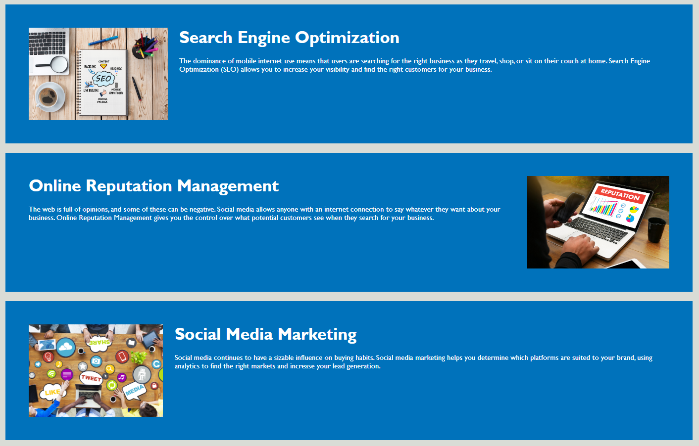
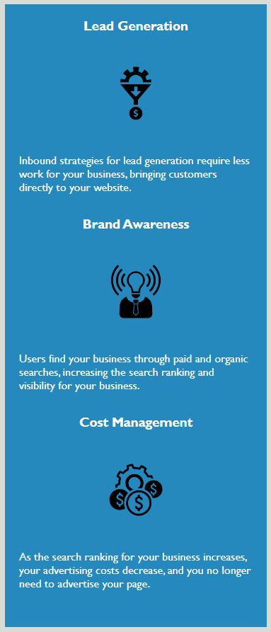

# Module 1 Challenge: css-test-page

## Description

This project was to help practice my css skills and learn how to apply them to an "on-the-job ticket" styled challenge. I used starter code and refractored it to follow accessibility standards and optimize it for search engines. I learned that creating a well organized code structure and helps not only developers read and understand your code, but also helps with the accessibility of your webpage for screen readers and search engines.

## Screenshots

## Application

The link to the live application of the webpage is: https://coldnebraska.github.io/css-test-page/

## Source Code

The source code is located at the website https://github.com/coldnebraska/css-test-page
